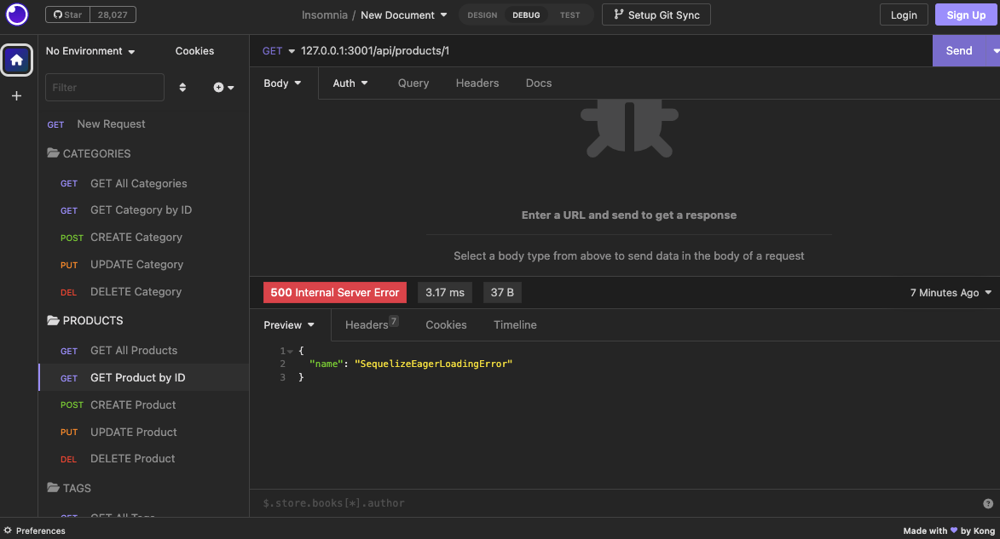
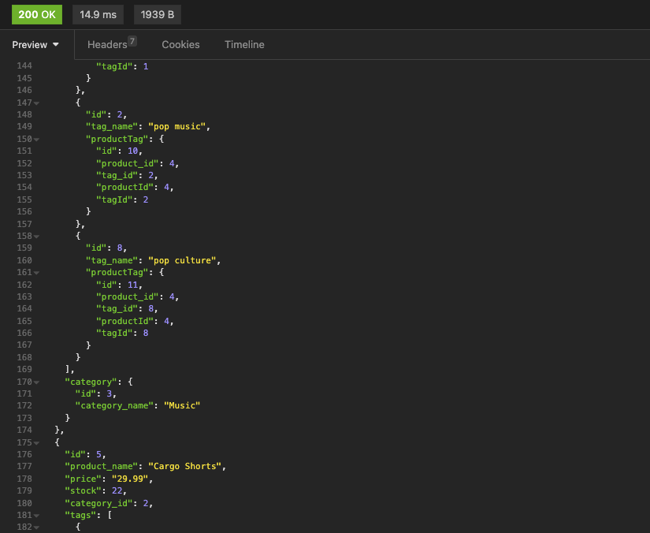
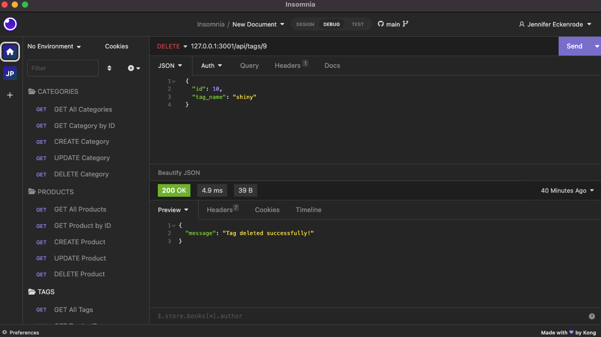

# E-commerce Back-End Endpoint Application

## Description

Repository Link:

(https://github.com/princessjenn/eCommerce-backEnd.git)

Demo Walkthrough Video Link:

(https://drive.google.com/file/d/1woUtnGcPe3NtoWHof0WC984tjiG0tO7q/view?usp=sharing)

My challenge was to build the back end for an e-commerce site. I took a working Express.js API and configured it to use Sequelize, and to interact with a MySQL database.

## Table of Contents

- [Installation](#installation)
- [Usage](#usage)
- [Contributing](#contributing)
- [Tests](#tests)
- [Questions](#questions)

## Installation

To begin, we need to make sure we have our database seeded into MySQL in our terminal!

`mysql -u root -p`

Then, enter your password.

`source db/schema.sql`

Now that your database has been inputted, let's install our dependencies, Sequelize, and dotenv.

`npm install`

This will install the Sequelize and dotenv modules.

Next, we must seed our database with sample seeds so that we can see them correctly when we apply the enpoint routes inside Insomnia. 

`npm run seed`

Finally, let's invoke our application,

`node server.js`

## Usage

Now we can open Insomnia while our program is running to test our back-end GET, PUT, POST, and DELETE API route endpoints!

## License 

This project is licensed under the terms of the MIT license.

## Contributing

To contribute to the project: 

1. start by forking the repository and creating a new branch specifically for your new feature or bug fix.
2. It's important to adhere to the project's coding standards and properly format your code.
3. When committing changes, be sure to write clear and concise messages that describe the changes made.
4. If your contribution affects the user interface or experience, include screenshots or animated GIFs in your pull request to help reviewers understand the changes. 
5. Additionally, make sure your code has been tested and all existing tests pass before submitting a pull request.
6. Finally, please provide a detailed description of your changes and explain why they're necessary !

Thanks so much for contributing! 

## Tests

 Testing and being sent back a '500 Internal Server error' response:

Finally, my Product Table from my Ecommerce database displaying on the 'GET Products' endpoint successfully:

One more confirmed '200 OK' response when the delete Tag route exceuted successfully:

## Questions

Ask me on Github: (https://https://github.com/princessjenn)

Email Me for more questions: j.eckenrode@me.com